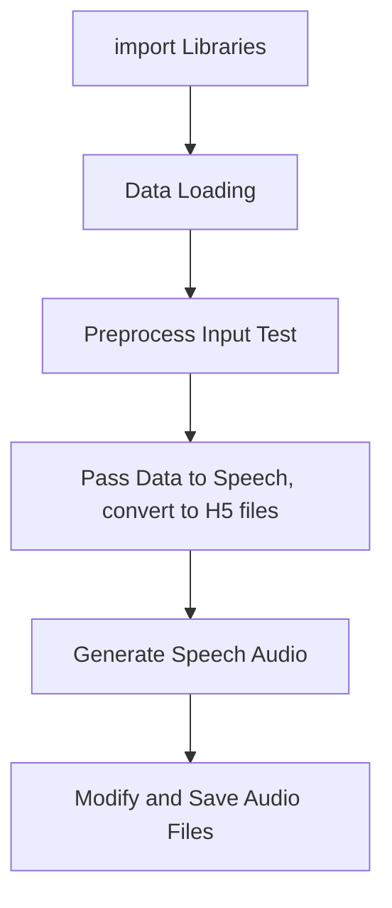

# 🌟 Signalyze: Sign Language to Text-to-Speech

**Our Designing Document Here**! 🚀 :
https://docs.google.com/document/d/1ewkkNGxOKf1M2MNxaz6vd0o2AKppRD_v_z_kCHBdar4/edit?usp=sharing

**Our Presentation Page**! 🐍: 
[Visit Our Presentation Page](https://willsnaketaka.github.io/CVProject/)

**Our Prototype Links**! 🐍: 
[Visit Rendor App site(please wait 50s~2 min sometimes)](https://hiworld-npd0.onrender.com/)

---

## 📖 Overview

Signalyze is an application that recognizes sign language gestures in webcam captions and then converts them into texts and speech, which will be benefitial for the deaf and hard-of-hearing communities.

### 🧩 Key Features:
- **Real-Time Gesture Recognition**: Capture and classify hand gestures instantly through Flask app, and webcap caption.
- **Text and Speech Output**: Convert recognized gestures into plain text and converted it into speech.
- **Flask app**: Simple and flexible app for presentation.

---

## 🛠️ Technologies Used

| Technology      | Purpose                                |
|------------------|----------------------------------------|
| **OpenCV**       | Image and Video processing   |
| **MediaPipe**    | Hand tracking and gesture detection    |
| **TensorFlow**   | Deep learning model for gesture recognition |
| **Keras**        | Simplified model building and training |
| **gTTS/Pyttsx3** | Text-to-speech synthesis               |
| **Subprocess**   | Text-to-speech MacOs version              |
| **Hugging Face** | Text-to-speech application              |
| **Flask**        | Backend for app integration            |
| **NumPy**        | Data manipulation                     |

---

Setup

Navigate to the directory where you want to clone/run/save the application:

cd your_selected_directory
Clone this repository:

git clone [https://github.com/.git](https://github.com/WillSnakeTaka/Signalyze.git)
Navigate to the Signalyze git repository:

cd Signalyzen
Use Python3 3.10 version in the cloned repository folder:

pyenv local 3.10
Create virtual environment in the cloned repository folder:

python -m venv .app.py

## 📊 General FlowChart

## 📊 Text to Speech

